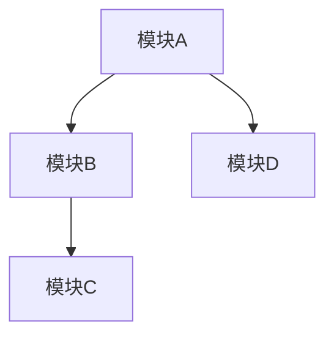

# AI助手协作开发指南

## 1. 协作准备

### 1.1 代码熟悉文档准备

在开始与AI助手合作前，先让AI熟悉项目结构，生成一份高信息密度的项目概览文档：

```markdown
# 项目架构文档模板

## 项目概览
[简明扼要描述项目目的和核心功能]

## 项目目录结构
[使用树形结构展示关键目录]

## 核心组件
[列出核心模块及其职责]

## 代码依赖关系
[使用Mermaid图表展示主要组件间的依赖]


## 功能模块调用逻辑
[主要功能的调用流程]

## 关键文件索引
| 文件路径 | 主要职责 | 关键方法/属性 | 修改频率 |
|---------|---------|--------------|---------|
| /path/to/file1.ts | 用户认证管理 | authenticate(), validate() | 高 |
| /path/to/file2.ts | 数据处理 | processData(), filterResults() | 中 |
```

### 1.2 代码示例注解

关键代码片段应包含详细注解：

```typescript
// 身份验证中间件
// 用途: 验证API请求的JWT令牌
// 依赖: UserService, TokenRepository
export async function authMiddleware(req: Request, res: Response, next: NextFunction) {
  const token = req.headers.authorization?.split(' ')[1];
  
  if (!token) {
    return res.status(401).json({ message: '未提供认证令牌' });
  }
  
  try {
    // 验证并解码令牌
    const decoded = verifyToken(token); // 调用utils/token.ts中的方法
    
    // 将用户信息附加到请求对象
    req.user = decoded;
    
    next();
  } catch (error) {
    return res.status(401).json({ message: '无效的认证令牌' });
  }
}
```

## 2. 对话结构与组织

### 2.1 任务初始化模板

每个新功能开发会话使用以下结构：

```
任务类型: [新功能开发/Bug修复/重构/性能优化]
功能描述: [具体描述任务目标和要求]
涉及组件: [列出受影响的组件]
相关文件: [列出可能需要修改的文件]
输入示例: [如适用，提供输入示例]
期望输出: [如适用，提供期望输出]
技术约束: [性能要求/兼容性/API规范等]
先前相关工作: [参考以前类似功能的实现]
```

### 2.2 开发阶段划分

将复杂功能开发分为多个阶段：

1. **需求分析阶段**：明确需求细节和验收标准
2. **设计阶段**：确定API设计、数据结构和算法
3. **实现阶段**：编写核心代码
4. **测试阶段**：编写测试用例
5. **集成阶段**：与现有系统集成
6. **文档阶段**：更新技术文档

### 2.3 上下文管理

每个会话保持单一责任原则：
- 一个会话专注一个功能开发
- 使用明确的分隔符区分开发阶段
- 在会话开始导入相关架构文档和功能指南

## 3. 文档迭代与维护

### 3.1 功能实现文档模板

实现新功能后，生成实现指南：

```markdown
# [功能名称]实现指南

## 功能概述
[简要描述功能目的和使用场景]

## 实现步骤
1. [步骤1 - 具体操作及相关文件]
2. [步骤2 - 具体操作及相关文件]
...

## 关键决策点
| 决策点 | 选择方案 | 决策理由 | 替代方案 |
|-------|---------|---------|---------|
| 数据存储方式 | Redis缓存 | 提高读取性能 | MySQL持久化存储 |
| ... | ... | ... | ... |

## 注意事项
- [实现过程中的关键注意点]
- [潜在问题及解决方案]

## 测试策略
- [单元测试覆盖点]
- [集成测试场景]
- [边界条件测试]
```

### 3.2 文档更新流程

1. **定期文档审查**：每实现3-5个相关功能后审查文档
2. **增量更新**：将新发现的模式和解决方案添加到现有文档
3. **重构时机**：当文档变得冗长或结构混乱时进行重构
4. **版本控制**：为文档添加版本号和修改日期

### 3.3 文档索引维护

创建并维护文档索引文件：

```markdown
# 技术文档索引

## 架构文档
- [项目整体架构](./architecture.md) - 项目模块构成和交互方式
- [数据流架构](./data_flow.md) - 系统中数据流转和处理逻辑

## 功能实现指南
- [用户认证实现](./auth_implementation.md) - JWT认证系统实现方法
- [数据导出功能](./data_export.md) - 批量数据导出功能实现

## 工作流程指南
- [新功能开发流程](./feature_dev_process.md) - 标准功能开发步骤
- [Bug修复流程](./bug_fix_process.md) - Bug定位和修复方法
```

## 4. 最佳实践

### 4.1 有效沟通技巧

- **明确性**：提供确切的需求和预期结果
- **上下文充分**：提供足够背景信息，但避免信息过载
- **渐进式引导**：复杂问题分解为多个小步骤
- **具体反馈**：指出具体问题而非模糊陈述

### 4.2 增强AI理解的策略

- **提供代码示例**：展示你期望的代码风格和模式
- **引用项目规范**：明确提及项目的命名约定、设计模式等
- **使用可视化**：对复杂逻辑使用流程图或UML图表
- **引用相似功能**：指向项目中已实现的类似功能

### 4.3 迭代开发策略

- **分步验证**：大功能分解为小步骤，每步验证
- **渐进式复杂度**：从核心功能开始，逐步添加边缘功能
- **问题跟踪**：记录遇到的问题和解决方案
- **复用模式**：识别并记录可复用的实现模式

## 5. 常见问题与解决方案

### 5.1 AI理解偏差修正

当AI误解需求时：
1. 明确指出偏差点
2. 提供具体的反例
3. 重新描述预期行为
4. 必要时提供更详细的上下文

### 5.2 代码质量保障

确保AI生成的代码符合项目标准：
1. 明确项目的代码风格和模式
2. 提供代码质量检查清单
3. 要求AI解释关键实现决策
4. 审查边界条件处理

### 5.3 避免同一会话处理过多功能

每个会话应专注于单一功能开发，优势包括：
- 减少上下文冲突
- 提高AI理解深度
- 简化问题追踪
- 增强文档清晰度

## 6. 协作工具整合

### 6.1 代码版本控制集成

- 在会话中引用具体git提交
- 使用diff格式展示代码变更
- 保留关键开发决策的讨论记录

### 6.2 项目管理工具集成

- 引用任务/票据ID
- 记录与票据相关的关键决策
- 生成适合添加到任务注释的总结

### 6.3 文档系统集成

- 生成可直接添加到技术文档的内容
- 维护实现决策日志
- 创建技术规范草案

## 7. 持续改进

### 7.1 效率提升策略

- 识别重复性任务并创建专用指南
- 记录成功的沟通模式
- 优化文档结构以提高信息检索效率

### 7.2 学习循环

对每个重要功能开发完成后：
1. 回顾实现过程
2. 总结遇到的挑战
3. 记录解决方案
4. 更新相关指南文档
5. 提炼可重用模式

---

*此指南应作为动态文档，根据项目需求和协作经验不断更新和完善。* 