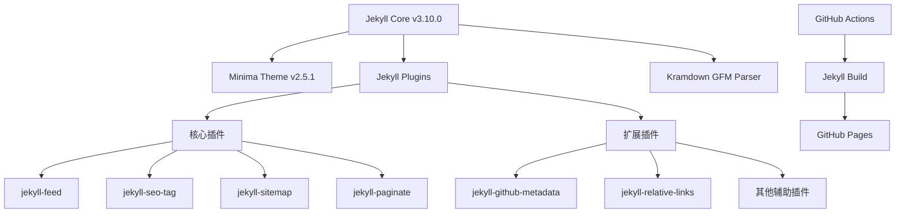

# Jekyll 博客项目架构文档 (AI 参考文档)

## 项目元数据
- **项目名称**: 个人博客
- **技术栈**: Jekyll, GitHub Pages, Markdown, Ruby
- **仓库位置**: GitHub - blog
- **部署状态**: 已成功部署
- **访问地址**: https://geyu210.github.io/blog
- **Jekyll版本**: 3.10.0 (GitHub Pages v232)
- **主题版本**: minima 2.5.1
- **最后更新**: 2024-03-17

## 项目概览
这是一个基于 Jekyll 的静态博客系统，使用 GitHub Pages 进行托管。项目采用 GitHub Pages 默认的 Jekyll 环境(v3.10.0)，使用 minima 主题(v2.5.1)，并集成了标准 Jekyll 插件。博客采用 Markdown 格式编写文章，通过 GitHub Actions 自动构建和部署。

## 项目目录结构与文件职责
```
blog/                       # 项目根目录
├── _posts/                 # 博客文章目录，所有文章均存放于此
│   └── YYYY-MM-DD-title.md # 文章文件命名格式
├── .github/                # GitHub相关配置
│   └── workflows/          # GitHub Actions工作流配置
│       └── pages.yml       # 自动构建部署配置
├── _config.yml             # Jekyll配置文件，定义站点设置和插件
├── Gemfile                 # Ruby依赖管理，定义博客所需的Ruby包
├── Gemfile.lock            # Ruby依赖版本锁定
├── index.md                # 网站首页
├── assets/                 # 资源文件目录
│   └── main.scss           # 主样式文件
├── PROJECT_ARCHITECTURE.md # AI参考文档（本文件）
├── BLOG_POST_GUIDE.md      # 博客文章管理指南
├── AI_COLLABORATION_GUIDE.md # AI协作指南
├── .gitignore              # Git忽略配置
└── README.md               # 项目说明文档
```

## 核心组件与依赖关系

### 1. Jekyll 核心
- **版本**: 3.10.0 (GitHub Pages v232)
- **主题**: minima 2.5.1
- **主题路径**: /usr/local/bundle/gems/minima-2.5.1
- **配置文件**: _config.yml
- **主要功能**: 
  - 静态站点生成
  - Markdown 解析和转换
  - 模板渲染
  - 资源文件处理

### 2. Jekyll 插件系统
- **插件配置位置**: _config.yml 和 Gemfile
- **核心插件**:
  - `jekyll-feed`: 生成RSS订阅源
  - `jekyll-seo-tag`: 添加SEO元标签
  - `jekyll-sitemap`: 生成站点地图
  - `jekyll-paginate`: 博客文章分页功能
- **其他启用的插件**:
  - `jekyll-coffeescript`: CoffeeScript支持
  - `jekyll-commonmark-ghpages`: CommonMark支持
  - `jekyll-gist`: GitHub Gist嵌入支持
  - `jekyll-github-metadata`: GitHub元数据支持
  - `jekyll-relative-links`: 相对链接支持
  - `jekyll-optional-front-matter`: 可选的Front Matter
  - `jekyll-readme-index`: 自动使用README作为索引
  - `jekyll-default-layout`: 默认布局支持
  - `jekyll-titles-from-headings`: 从标题生成页面标题

### 3. 解析器与处理器
- `kramdown-parser-gfm`: GitHub风格的Markdown解析器

### 4. 组件依赖图


## 数据流动与处理逻辑

### 1. 内容处理流程
```
Markdown文章(_posts/*.md) 
→ Jekyll解析器(处理Front Matter) 
→ Kramdown GFM解析Markdown
→ 主题模板渲染(minima主题) 
→ 生成静态HTML 
→ 部署到GitHub Pages
```

### 2. 构建部署流程
```
Git Push到main分支 
→ 触发GitHub Actions(.github/workflows/pages.yml) 
→ actions/jekyll-build-pages@v1处理 
→ 输出到_site目录 
→ actions/upload-pages-artifact@v3上传 
→ actions/deploy-pages@v4部署
```

### 3. URL路径映射
| 内容类型 | 文件位置 | 生成的URL路径 |
|---------|----------|-------------|
| 首页 | index.md | / |
| 博客文章 | _posts/YYYY-MM-DD-title.md | /YYYY/MM/DD/title.html |
| 分类页面 | 自动生成 | /categories/ |
| 标签页面 | 自动生成 | /tags/ |
| RSS订阅 | 插件生成 | /feed.xml |
| 站点地图 | 插件生成 | /sitemap.xml |

## 配置文件解析

### 1. _config.yml 键值对说明
```yaml
title: "博客标题"            # 网站标题
description: "网站描述"      # 网站描述，用于SEO
baseurl: "/blog"           # 子路径，与GitHub仓库名对应
url: "https://..."         # 完整URL前缀
theme: minima              # 使用的主题
plugins:                   # 启用的插件列表
  - jekyll-feed
  - jekyll-seo-tag
  - jekyll-sitemap
  - jekyll-paginate
paginate: 5                # 每页显示的文章数
```

### 2. Gemfile 依赖说明
```ruby
gem "github-pages"         # GitHub Pages兼容环境(v232)
gem "webrick"              # HTTP服务器（本地开发用）
```

### 3. GitHub Actions 配置说明
工作流文件 `.github/workflows/pages.yml` 定义了:
- 触发条件: 推送到main分支
- 构建步骤: 使用Jekyll官方构建Action
- 部署步骤: 上传并发布到GitHub Pages

## 文章格式规范

### 1. Front Matter 必要字段
```yaml
---
layout: post                # 使用的布局模板
title: "文章标题"            # 文章标题
date: YYYY-MM-DD HH:MM:SS   # 发布日期和时间
categories: [分类1, 分类2]   # 文章分类（可多个）
tags: [标签1, 标签2]         # 文章标签（可多个）
---
```

### 2. Markdown 语法支持
- 标准 Markdown: 标题、段落、列表、链接等
- GitHub Flavored Markdown: 表格、代码块高亮、任务列表等
- Kramdown GFM: GitHub风格的Markdown扩展语法
- Jekyll Liquid 语法: 模板标签、条件语句、循环等

## 开发与维护指南

### 1. 本地开发环境设置
- Ruby 环境: 2.6.0 或更高版本
- 依赖安装: `bundle install`
- 本地预览: `bundle exec jekyll serve`
- 预览地址: http://localhost:4000/blog/

### 2. 常见修改场景
- 添加新文章: 在 `_posts` 目录创建文件
- 修改主题: 更新 `_config.yml` 中的 theme 值
- 添加自定义样式: 创建或修改 `assets/main.scss` 文件
- 添加新页面: 在根目录创建 .md 或 .html 文件

### 3. 故障排除与调试
- 构建日志: GitHub Actions 构建日志
- 本地调试: `bundle exec jekyll build --verbose`
- 依赖冲突: 注意 GitHub Pages gem 版本限制(v232)

## AI助手操作指引

### 1. 访问文章内容
- 需查看现有文章: 检索 `_posts` 目录下的 .md 文件
- 了解站点结构: 参考 `_config.yml` 配置

### 2. 常见任务处理流程
- 创建新文章: 按 `YYYY-MM-DD-title.md` 格式在 `_posts` 目录添加
- 修改站点配置: 编辑 `_config.yml` 文件
- 修改页面布局: 需理解 minima 2.5.1 主题结构
- 添加自定义样式: 修改 `assets/main.scss` 文件

### 3. 资源引用方式
- 内部链接: `[文本](/blog/YYYY/MM/DD/title.html)`
- 图片引用: ``
- 其他页面: `[文本](/blog/page-name/)`

### 4. Liquid语法注意事项
- 在Markdown文件中不要直接使用未转义的Liquid标签
- 避免使用Jekyll特定的链接标签如`post_url`
- 使用常规Markdown链接语法和绝对/相对URL
- 如需展示Liquid语法示例，使用代码块并用反引号转义

## 项目演化计划
- 添加评论功能
- 实现自定义主题
- 增加搜索功能
- 添加分析统计
- 解决GitHub Pages依赖警告
- 添加分页索引模板 