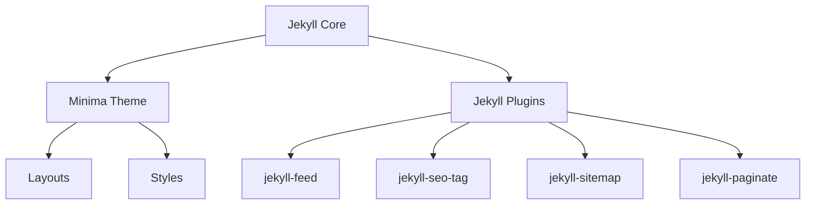

# Jekyll 博客项目架构文档

## 项目概览
这是一个基于 Jekyll 的静态博客系统，使用 GitHub Pages 进行托管。项目采用 Jekyll 4.3.2 版本，使用 minima 主题，并集成了多个 Jekyll 插件以增强功能。

## 项目目录结构
```
blog/
├── _posts/           # 博客文章目录
├── .github/          # GitHub Actions 配置
├── _config.yml       # Jekyll 配置文件
├── Gemfile          # Ruby 依赖管理
├── Gemfile.lock     # Ruby 依赖版本锁定
└── README.md        # 项目说明文档
```

## 核心组件

### 1. Jekyll 核心
- 版本：4.3.2
- 主题：minima 2.5
- 功能：静态站点生成、Markdown 处理、模板渲染

### 2. Jekyll 插件
- jekyll-feed：RSS 订阅支持
- jekyll-seo-tag：SEO 优化
- jekyll-sitemap：站点地图生成
- jekyll-paginate：文章分页功能

## 代码依赖关系


## 功能模块调用逻辑

### 1. 博客文章处理流程
1. 在 `_posts` 目录创建 Markdown 文件
2. Jekyll 解析文章 front matter
3. 应用主题布局和样式
4. 生成静态 HTML 页面

### 2. 部署流程
1. 推送代码到 GitHub
2. GitHub Actions 触发构建
3. 使用 Ruby 3.1 环境构建站点
4. 部署到 GitHub Pages

## 关键文件索引
| 文件路径 | 主要职责 | 关键配置/功能 | 修改频率 |
|---------|---------|--------------|---------|
| _config.yml | 站点配置 | 主题设置、插件配置、站点信息 | 中 |
| Gemfile | 依赖管理 | Ruby 包依赖定义 | 低 |
| _posts/*.md | 博客内容 | 文章内容和元数据 | 高 |
| .github/workflows/pages.yml | CI/CD | 自动构建和部署配置 | 低 |

## 开发规范

### 1. 文章命名规范
- 文件名格式：`YYYY-MM-DD-title.md`
- 必须包含 front matter
- 使用 Markdown 格式编写

### 2. 目录结构规范
- 保持目录结构清晰
- 遵循 Jekyll 默认目录约定
- 自定义资源放在 `assets` 目录

### 3. 版本控制规范
- 忽略构建输出和缓存文件
- 保持 Gemfile.lock 更新
- 提交信息清晰明确

## 部署环境
- 构建环境：GitHub Actions
- Ruby 版本：3.1
- 部署目标：GitHub Pages
- 访问地址：https://[username].github.io/blog

## 注意事项
1. 本地开发时注意 Ruby 版本兼容性
2. 修改 `_config.yml` 后需要重新构建
3. 确保文章 front matter 格式正确
4. 定期更新依赖包版本

## 常见问题解决方案
1. 构建失败
   - 检查 Ruby 版本兼容性
   - 验证 Gemfile 依赖配置
   - 查看 GitHub Actions 日志

2. 样式问题
   - 检查主题配置
   - 验证自定义 CSS 覆盖
   - 确认资源文件路径

3. 部署问题
   - 确认 GitHub Pages 设置
   - 检查 Actions 权限配置
   - 验证构建输出完整性 